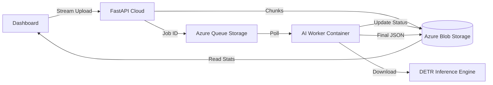

# ☁️ CattleCounter: Aerial Livestock Analytics Platform


**CattleCounter** is a cloud-native MLOps system designed to automate cattle counting from drone footage. It leverages **Computer Vision (Transformers)** and a distributed architecture to process high-resolution video asynchronously.

## 🏗️ System Architecture

The system implements an **Asynchronous Worker Pattern** to handle heavy AI workloads without blocking the user interface.



## 🌟 Key Features

* ⚡ **Streaming Ingestion:** Uploads GB-sized drone videos without RAM spikes or timeouts using chunked streaming.

* 🧠 **AI Engine:** Uses DETR (DEtection TRansformer), fine-tuned for zenithal (top-down) views to overcome occlusion issues in crowded herds.

* 📊 **Observability Dashboard**: Real-time monitoring of AI processing progress, historical mission logs, and audit capabilities (video playback).

* ☁️ **Auto-Healing Cloud:** Infrastructure-as-Code logic ensures queues and containers are self-repairing.

## 📂 Project Structure

```text
CattleCounter_MLOps/
├── .github/workflows/  # CI/CD Pipeline (Build & Deploy)
├── api/                # FastAPI Application (The Producer)
│   └── main.py         # Endpoints definition
├── worker/             # AI Consumer (Azure Container Instance)
│   └── main.py         # Polling loop & processing logic
├── core/               # Shared Cloud Configuration
│   ├── azure_client.py # Azure SDK wrappers
│   └── config.py       # Environment variables management
├── ml_engine/          # Computer Vision Logic (PyTorch/Supervision)
│   └── counter.py      # Logic for DETR + ByteTrack
├── dashboard/          # Streamlit Ops Center (Frontend)
├── Dockerfile.api      # Docker (Lightweight API) image for the REST API 
├── Dockerfile.worker   # Docker (Heavy and Pre-cached Models)image for the AI Worker
└── requirements.txt
```

## 🛠️ Tech Stack

* **Infrastructure:** Azure Web Apps, Azure Container Instances (ACI).

* **Storage:** Azure Blob Storage (Video/Data), Azure Queue Storage (Messaging).

* **Backend:** Python 3.9, FastAPI, Uvicorn.

* **AI Engine:** PyTorch, Hugging Face Transformers, Supervision.

* **Containerization:** Docker, Docker Compose.

## 🚀 Deployment Guide

1. Prerequisites

    * Azure Subscription (Student or Standard).

    * Azure CLI installed.

    * GitHub Repository.    

2. Environment Setup

Create a `.env` file for local development (do not commit this):
```bash
AZURE_STORAGE_CONNECTION_STRING="DefaultEndpointsProtocol=https;AccountName=..."

API_URL="http://localhost:8000" # Or your Cloud URL
```

3. CI/CD with GitHub Actions

This project is configured to deploy automatically on push to main.

1. Create an Azure Container Registry (ACR).

2. Create an Azure Web App (Linux/Docker).

3. Add the following secrets to GitHub:
    
    * `AZURE_CREDENTIALS` (Service Principal JSON)
    
    * `REGISTRY_LOGIN_SERVER`, `USERNAME`, `PASSWORD`
    
    * `AZURE_WEBAPP_NAME`
    
    * `AZURE_STORAGE_CONNECTION_STRING`

4. Running Locally (Docker Compose)
```bash
docker-compose up --build
```

* Dashboard: `http://localhost:8501`

* API Docs: `http://localhost:8000/docs`

## 🚀 Local Development Setup

1. **Prerequisites**

    * Python 3.9+
    * Azure Storage Account (Connection String required)

2. **Environment Configuration**

    Create a `.env` file in the root directory:
```bash
AZURE_STORAGE_CONNECTION_STRING="your_connection_string"
```

3. **Install Dependencies**

```bash
pip install -r requirements.txt
```

4. **Run the API (Terminal 1)**

    Start the web server to accept video uploads.
```bash
uvicorn api.main:app --reload --port 8000
```

*Access Swagger UI at: `http://localhost:8000/docs`*

5. *Run the Worker (Terminal 2)*

    Start the background worker to process the queue.
```bash
python -m worker.main
```

## 📡 API Usage

**Submit a Job**

**POST** `/submit-job`

* **Body:** `form-data` with key `file` (Select a `.mp4` video).
* **Response:**
```json
{
  "job_id": "a1b2c3d4-...",
  "status": "queued",
  "message": "Video uploaded successfully. Processing started."
}
```

## 📈 Observability & Analytics

The "Ops Center" dashboard provides:

* **Mission Control:** Upload and track individual jobs.

* **Insights:** Graphs showing herd size trends over time.

* **Audit Log:** Replay processed videos with bounding box overlays to verify accuracy.

##
*Authored by Carlos Luis Noriega - Lead AI Engineer*
