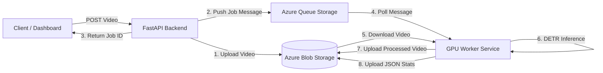

# ☁️ CattleCounter: MLOps Cloud Architecture


**CattleCounter MLOps** is a scalable, cloud-native system designed to process high-resolution aerial video footage for livestock analytics. 

Unlike real-time APIs, this architecture implements an **Asynchronous Worker Pattern** using Azure Queues. This allows the system to handle long-running computer vision tasks (Remote Video Inference with Transformers) without blocking the user interface or timing out HTTP requests.

## 🏗️ System Architecture

The system is decoupled into two main microservices: the **API (Producer)** and the **Worker (Consumer)**.



## 🌟 Key Features

* **Asynchronous Processing:** Decouples video upload from video processing. The API responds immediately with a job_id, while the heavy lifting happens in the background.

* **Transformer-Based Vision:** Utilizes DETR (DEtection TRansformer) for global context understanding, superior to standard CNNs for counting crowded livestock from zenithal angles.

* **State Management:** Uses Azure Queue Storage to manage job distribution and state (Pending -> Processing -> Completed).

* **Robust Tracking:** Implements ByteTrack for persistent object ID tracking across video frames.

## 🛠️ Tech Stack

* **Infrastructure:** Azure Web Apps, Azure Container Instances (ACI).

* **Storage:** Azure Blob Storage (Video/Data), Azure Queue Storage (Messaging).

* **Backend:** Python 3.9, FastAPI, Uvicorn.

* **AI Engine:** PyTorch, Hugging Face Transformers, Supervision.

* **Containerization:** Docker, Docker Compose.

## 📂 Project Structure

```text
CattleCounter_MLOps/
├── api/                # FastAPI Application (The Producer)
│   └── main.py         # Endpoints definition
├── worker/             # Background Service (The Consumer)
│   └── main.py         # Polling loop & processing logic
├── core/               # Shared Configuration
│   ├── azure_client.py # Azure SDK wrappers
│   └── config.py       # Environment variables management
├── ml_engine/          # The Brain (Imported from Research)
│   └── counter.py      # Logic for DETR + ByteTrack
├── Dockerfile.api      # Docker image for the REST API
├── Dockerfile.worker   # Docker image for the AI Worker
└── requirements.txt
```

## 🚀 Local Development Setup

1. **Prerequisites**

    * Python 3.9+
    * Azure Storage Account (Connection String required)

2. **Environment Configuration**

    Create a `.env` file in the root directory:
```bash
AZURE_STORAGE_CONNECTION_STRING="your_connection_string"
```

3. **Install Dependencies**

```bash
pip install -r requirements.txt
```

4. **Run the API (Terminal 1)**

    Start the web server to accept video uploads.
```bash
uvicorn api.main:app --reload --port 8000
```

*Access Swagger UI at: `http://localhost:8000/docs`*

5. *Run the Worker (Terminal 2)*

    Start the background worker to process the queue.
```bash
python -m worker.main
```

## 📡 API Usage

**Submit a Job**

**POST** `/submit-job`

* **Body:** `form-data` with key `file` (Select a `.mp4` video).
* **Response:**
```json
{
  "job_id": "a1b2c3d4-...",
  "status": "queued",
  "message": "Video uploaded successfully. Processing started."
}
```

##
*Authored by Carlos Luis Noriega - Lead AI Engineer*
